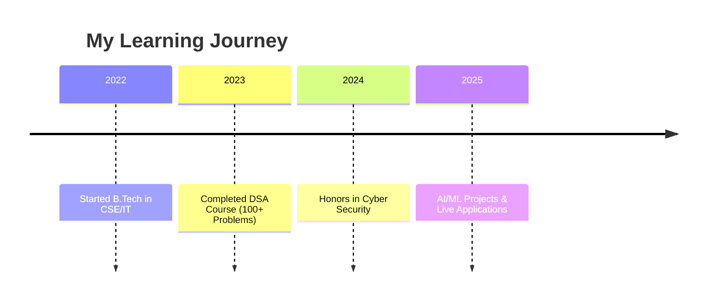
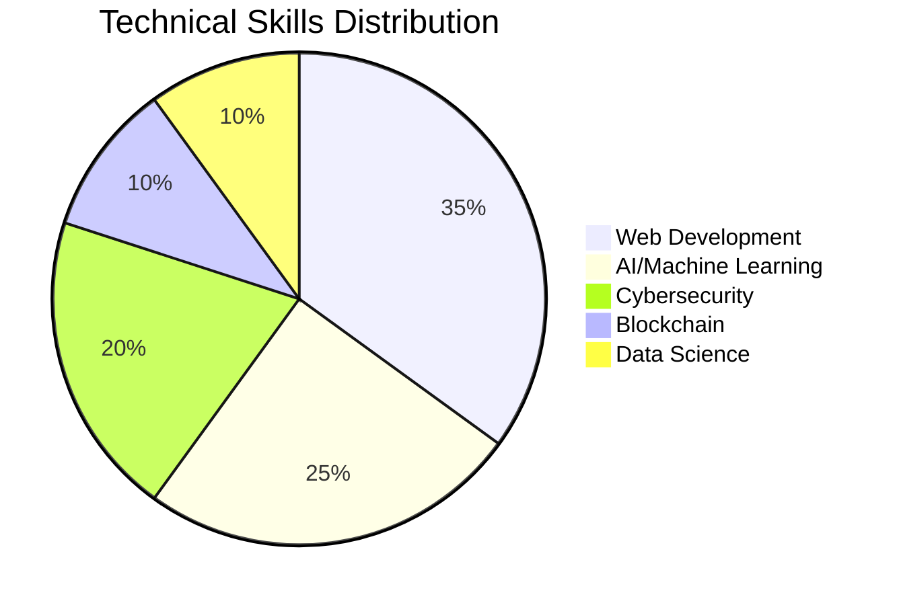

<div align="center">
  
# 🚀 Hey there! I'm Prateek Singh
### 💻 Full-Stack Developer | 🔐 Cybersecurity Enthusiast | 🤖 AI/ML Engineer


[](https://linktr.ee/urstrulyprateek)
[](https://linkedin.com/in/prateek-singh)
[](mailto:emperorprateek74@gmail.com)
[](https://github.com/urstrulyPrateeK)
[](tel:+919210882150)


</div>

## 🌟 FEATURED LIVE PROJECTS

<div align="center">

### 🏆 **STAR PROJECTS - LIVE & IN ACTION** 🏆

</div>

<table width="100%">
<tr>
<td width="50%">

### 🤖 [Praktice.AI - AI Mock Interview Platform](https://prakticeai.vercel.app/)
**🔥 LIVE PROJECT 🔥**

<div align="center">


</div>

🎯 **Revolutionary AI-powered mock interview platform**
- 🚀 Built with React 19, TypeScript, TailwindCSS
- 🧠 Google Gemini AI integration for real-time feedback  
- 🔐 Clerk authentication with social login
- 📊 Live analytics & progress tracking
- 🔥 Firebase Firestore for real-time data

</td>
<td width="50%">

### 🌐 [AI LinkedIn Comment Assistant](https://chromewebstore.google.com/detail/ppobihemedjfiggfmcecefdaikfkhajo)
**🔥 LIVE CHROME EXTENSION 🔥**

<div align="center">


</div>

🎯 **Game-changing LinkedIn engagement tool**
- ⚡ Chrome Extension Manifest V3 compliant
- 🤖 Google Generative AI powered
- 🎨 13+ AI-generated comment tones
- � Real-time post context analysis
- 💼 Authentic professional conversations

</td>
</tr>
</table>

<div align="center">

</div>

## 🎓 Education & Achievements

<div align="center">



</div>

<table width="100%">
<tr>
<td width="70%">

### 🏛️ **Abdul Kalam Technical University** (2022 - 2026)
**Bachelor of Technology - Computer Science & Information Technology**

<div align="left">


</div>

</td>
<td width="30%">

### 📈 **Performance**
```
Current CGPA: 8.3/10
Academic Year: 4th
Specialization: CSE/IT
```

</td>
</tr>
</table>

## 🏆 Certifications & Courses

<div align="center">

| 🎯 **Course** | 🏢 **Institution** | 🏅 **Achievement** |
|---------------|-------------------|-------------------|
| **Data Structures & Algorithms** | GeeksforGeeks | ✅ **100+ Problems Solved** |
| **Honors in Cyber Security** | AKTU | 🔐 **Security Expert** |

</div>

<div align="center">

</div>

## 🛠️ Technical Arsenal

<div align="center">

### 💻 **Programming Languages**


### 🚀 **Frameworks & Libraries**


### 🛡️ **Cybersecurity & Tools**


### ☁️ **Cloud & Deployment**


</div>

<div align="center">

</div>

## 📊 GitHub Analytics

<div align="center">


</div>

<div align="center">

[](https://git.io/streak-stats)

</div>

<div align="center">

### 🏆 **GitHub Achievements**


</div>

<div align="center">

### 📈 **Contribution Graph**
[](https://github.com/ashutosh00710/github-readme-activity-graph)

</div>

<div align="center">

</div>

## 🚀 Project Portfolio

### 🔥 **Live Applications**

<table width="100%">
<tr>
<td width="33%">

#### 🎭 **Gender Detection Through Voice**


🎯 **Deep learning model for audio-based gender detection**
- 🎵 Mozilla Common Voice dataset
- 📊 Mel Spectrogram feature extraction
- 🧠 5-layer neural network with dropout
- 🌐 Flask web application with real-time predictions

</td>
<td width="33%">

#### 🔐 **AES Encryption Banking System**


🏦 **Secure banking application with AES-256**
- 🔒 AES-256 encryption for data security
- 💳 Complete banking operations interface
- 🛡️ Secure authentication protocols
- ⚡ Express.js backend architecture

</td>
<td width="33%">

#### ⛓️ **Blockchain Ledger System**


🔗 **Distributed ledger with proof-of-work**
- ⛏️ SHA-256 cryptographic hashing
- 🔐 Proof-of-work consensus mechanism
- 💰 Secure wallet architecture
- 🔒 Immutable data integrity

</td>
</tr>
</table>

<div align="center">

#### 🛒 **Mart in Seconds - E-commerce Backend**


🛍️ **Scalable e-commerce backend system**
- 🏗️ RESTful API architecture
- 📦 Real-time inventory management
- 💳 Transaction handling system
- 🔄 Modular deployment architecture

</div>

<div align="center">

</div>

## 🎯 Expertise Breakdown

<div align="center">



</div>

<table width="100%">
<tr>
<td width="50%">

### 🎯 **Core Competencies**

```
🌐 Full-Stack Development     ████████████ 95%
🤖 AI/Machine Learning        ██████████   85%
🔐 Cybersecurity             █████████    80%
⛓️  Blockchain Technology     ████████     75%
📊 Data Science              ███████      70%
☁️  Cloud Computing          ██████       65%
```

</td>
<td width="50%">

### 🚀 **Problem-Solving Skills**

```
🧠 Algorithm Design          ████████████ 90%
🔍 System Analysis           ███████████  88%
🛠️ Code Optimization         ██████████   85%
🔧 Debugging                 ████████████ 92%
📈 Performance Tuning        █████████    82%
🏗️ Architecture Design       ████████     78%
```

</td>
</tr>
</table>

<div align="center">

</div>

## 🏆 Achievement Highlights

<div align="center">

| 🎯 **Achievement** | 📊 **Metric** | 🏅 **Impact** |
|-------------------|---------------|---------------|
| **Live Applications** | 2+ Projects | 🌍 **Global Users** |
| **Coding Problems** | 100+ Solved | 🧠 **DSA Expert** |
| **GitHub Projects** | 15+ Repositories | 🚀 **Open Source** |
| **CGPA** | 8.3/10 | 🎓 **Academic Excellence** |
| **Extensions** | Chrome Web Store | 💻 **Production Ready** |

</div>

<div align="center">

</div>

## 🌐 Connect & Collaborate

<div align="center">

### 🤝 **Let's Build Something Amazing Together!**


<div style="margin: 20px 0;">

[](https://linktr.ee/urstrulyprateek)
[](mailto:emperorprateek74@gmail.com)
[](tel:+919210882150)
[](https://linkedin.com/in/prateek-singh)

</div>

### 💡 **Currently Working On:**
- 🤖 Advanced AI/ML Projects
- 🔐 Cybersecurity Research
- 🌐 Full-Stack Applications
- ⛓️ Blockchain Solutions

### 🎯 **Open For:**
- 💼 **Internship Opportunities**
- 🚀 **Freelance Projects** 
- 🤝 **Open Source Contributions**
- 📚 **Knowledge Sharing**

</div>

<div align="center">

### 🎨 **Profile Views**


</div>
<!--
**urstrulyPrateeK/urstrulyPrateek** is a ✨ _special_ ✨ repository because its `README.md` (this file) appears on your GitHub profile.

Here are some ideas to get you started:

- 🔭 I’m currently working on ...
- 🌱 I’m currently learning ...
- 👯 I’m looking to collaborate on ...
- 🤔 I’m looking for help with ...
- 💬 Ask me about ...
- 📫 How to reach me: ...
- 😄 Pronouns: ...
- ⚡ Fun fact: ...
-->
