```mermaid
timeline
    title 🎓 My Academic & Professional Journey
    2022-2026 : 🏛️ B.Tech CSE/IT (CGPA: 8.3/10)
             : 📚 Abdul Kalam Technical University
    2023     : 🧠 DSA Mastery (100+ Problems Solved)
             : 🏆 GeeksforGeeks Certification
    2024     : 🔐 Honors in Cyber Security
             : 🛡️ AKTU Specialization
    2025     : 🚀 Live AI/ML Projects Deployed
             : 🌐 Chrome Extension Published
             : 🤖 AI-Powered Applications
```

<div align="center">

<!-- Animated Banner -->


<br/>


</div>

🎯 **Game-changing LinkedIn engagement tool**
- ⚡ Chrome Extension Manifest V3 compliant
- 🤖 Google Generative AI powered
- 🎨 13+ AI-generated comment tones
- 🔄 Real-time post context analysis
- 💼 Authentic professional conversations

**🚀 [Install Now & Boost Your LinkedIn Game!](https://chromewebstore.google.com/detail/ppobihemedjfiggfmcecefdaikfkhajo)**type=waving&color=gradient&customColorList=6,11,20&height=200&section=header&text=Prateek%20Singh&fontSize=50&fontColor=fff&animation=fadeIn&fontAlignY=35&desc=Full-Stack%20Developer%20|%20AI/ML%20Engineer%20|%20Cybersecurity%20Expert&descAlignY=55&descAlign=50"/>

<!-- Professional Title with Slower Animation -->
<h1 align="center">
  
</h1>

<!-- Animated Subtitle with Slower Speed -->
<h3 align="center">
  
</h3>

<!-- Matrix Rain Effect Separator -->


<!-- Social Links with Hover Effects -->
<p align="center">
  <a href="https://linktr.ee/urstrulyprateek">
    
  </a>
  <a href="https://linkedin.com/in/prateek-singh">
    
  </a>
  <a href="mailto:emperorprateek74@gmail.com">
    
  </a>
  <a href="https://github.com/urstrulyPrateeK">
    
  </a>
</p>

<!-- Animated Divider -->


</div>

<!-- STAR PROJECTS SHOWCASE -->
<div align="center">
  


### 🏆 **STAR PROJECTS - LIVE & IN ACTION** 🏆
*Click to experience the magic!*

</div>

<!-- Animated Project Cards -->
<table width="100%">
<tr>
<td width="50%" align="center">

<div align="center">
  
### 🤖 **[Praktice.AI - AI Mock Interview Platform](https://prakticeai.vercel.app/)**
**🔥 LIVE PROJECT - EXPERIENCE IT NOW! 🔥**

<!-- Animated Status Badges -->
<p align="center">
  
  <br/>
  
  
  
</p>

</div>

🎯 **Revolutionary AI-powered mock interview platform**
- 🚀 Built with React 19, TypeScript, TailwindCSS
- 🧠 Google Gemini AI for real-time feedback  
- 🔐 Clerk authentication & social login
- 📊 Live analytics & progress tracking
- 🔥 Firebase Firestore real-time data

**🎯 [🚀 Start Your Mock Interview Journey!](https://prakticeai.vercel.app/)**

</td>
<td width="50%">

### 🌐 [AI LinkedIn Comment Assistant](https://chromewebstore.google.com/detail/ppobihemedjfiggfmcecefdaikfkhajo)
**🔥 LIVE CHROME EXTENSION 🔥**

<div align="center">


</div>

🎯 **Game-changing LinkedIn engagement tool**
- ⚡ Chrome Extension Manifest V3 compliant
- 🤖 Google Generative AI powered
- 🎨 13+ AI-generated comment tones
- � Real-time post context analysis
- 💼 Authentic professional conversations

</td>
</tr>
</table>

<div align="center">

</div>

<!-- EDUCATION SECTION WITH ADVANCED ANIMATIONS -->
<div align="center">


<!-- Interactive Timeline -->


</div>

<!-- Animated Education Cards -->
<table width="100%">
<tr>
<td width="70%">

<div align="center">
  
### 🏛️ **Abdul Kalam Technical University** (2022 - 2026)
**Bachelor of Technology - Computer Science & Information Technology**

<!-- Animated Academic Badges -->
<p align="left">
  
  
  
</p>

</div>

</td>
<td width="30%">

### 📈 **Academic Excellence**
```
🎯 Current CGPA: 8.3/10
📅 Academic Year: 4th (Final)
🎓 Specialization: CSE/IT
🏆 Academic Standing: Top Performer
📊 Technical Focus: AI/ML & Security
```

</td>
</tr>
</table>

<!-- CERTIFICATIONS WITH PROFESSIONAL ANIMATIONS -->
<div align="center">


<!-- Professional Achievement Cards -->
<table width="100%">
<tr>
<td align="center" width="50%">

#### 🧠 **Data Structures & Algorithms**


**🏅 Master Level Achievement**
- ✅ **100+ Coding Problems Mastered**
- 🚀 **Advanced Algorithm Implementation**
- 💡 **Optimized Problem-Solving Techniques**

</td>
<td align="center" width="50%">

#### 🔐 **Honors in Cyber Security**


**🛡️ Security Specialist**
- � **Advanced Cryptographic Systems**
- 🛠️ **Penetration Testing & Analysis**
- 🔍 **Vulnerability Assessment Expert**

</td>
</tr>
</table>

</div>

<div align="center">

</div>

<!-- TECHNICAL ARSENAL WITH ADVANCED ANIMATIONS -->
<div align="center">


<!-- Interactive Tech Stack Visualization -->

### 💻 **Programming Languages**
<p align="center">
  
</p>

### 🚀 **Frameworks & Libraries**
<p align="center">
  
</p>

### 🛡️ **Cybersecurity & Blockchain**
<p align="center">
  
  
  
  
</p>

### ☁️ **Cloud & DevOps**
<p align="center">
  
</p>

<!-- Animated Tech Proficiency -->
<div align="center">
  
#### 🎯 **Technology Focus Areas**
<p align="center">


</p>

</div>

</div>

<div align="center">

</div>

<!-- GITHUB ANALYTICS WITH PROFESSIONAL ANIMATIONS -->
<div align="center">


<!-- Advanced GitHub Stats Grid -->
<table width="100%">
<tr>
<td width="50%" align="center">

### 📊 **Performance Metrics**


</td>
<td width="50%" align="center">

### 🔥 **Language Distribution**


</td>
</tr>
</table>

<!-- Streak Stats with Animation -->
<div align="center" style="margin: 20px 0;">

### ⚡ **Contribution Streak**
[](https://git.io/streak-stats)

</div>

<!-- Achievement Trophies -->
<div align="center" style="margin: 20px 0;">

### 🏆 **GitHub Achievements**


</div>

<!-- Contribution Graph with Professional Look -->
<div align="center" style="margin: 20px 0;">

### 📈 **Development Activity**


</div>

</div>

<div align="center">

</div>

## 🚀 Project Portfolio

### 🔥 **Live Applications**

<table width="100%">
<tr>
<td width="33%">

#### 🛒 **Mart in Seconds - E-commerce Backend**


🛍️ **Scalable e-commerce backend system**
- �️ RESTful API architecture
- 📦 Real-time inventory management
- 💳 Transaction handling system
- 🔄 Modular deployment architecture

</td>
<td width="33%">

#### �🎭 **Gender Detection Through Voice**


🎯 **Deep learning model for audio-based gender detection**
- 🎵 Mozilla Common Voice dataset
- 📊 Mel Spectrogram feature extraction
- 🧠 5-layer neural network with dropout
- 🌐 Flask web application with real-time predictions

</td>
<td width="33%">

#### 🔐 **AES Encryption Banking System**


🏦 **Secure banking application with AES-256**
- 🔒 AES-256 encryption for data security
- 💳 Complete banking operations interface
- 🛡️ Secure authentication protocols
- ⚡ Express.js backend architecture

</td>
</tr>
<tr>
<td colspan="3" align="center">

#### ⛓️ **Blockchain Ledger System**


🔗 **Distributed ledger with proof-of-work consensus**
- ⛏️ SHA-256 cryptographic hashing for security
- 🔐 Proof-of-work consensus mechanism
- 💰 Secure wallet architecture with unique identifiers
- 🔒 Immutable data integrity and tamper-proof design

</td>
</tr>
</table>

<div align="center">

</div>

## 🎯 Expertise Breakdown

<div align="center">


</div>

<table width="100%">
<tr>
<td width="50%">

### 🎯 **Core Competencies**

```
🌐 Full-Stack Development     ████████████ 95%
🤖 AI/Machine Learning        ██████████   85%
🔐 Cybersecurity             █████████    80%
⛓️  Blockchain Technology     ████████     75%
📊 Data Science              ███████      70%
☁️  Cloud Computing          ██████       65%
```

</td>
<td width="50%">

### 🚀 **Problem-Solving Skills**

```
🧠 Algorithm Design          ████████████ 90%
🔍 System Analysis           ███████████  88%
🛠️ Code Optimization         ██████████   85%
🔧 Debugging                 ████████████ 92%
📈 Performance Tuning        █████████    82%
🏗️ Architecture Design       ████████     78%
```

</td>
</tr>
</table>

<div align="center">

</div>

## 🏆 Achievement Highlights

<div align="center">

| 🎯 **Achievement** | 📊 **Metric** | 🏅 **Impact** |
|-------------------|---------------|---------------|
| **Live Applications** | 2+ Projects | 🌍 **Global Users** |
| **Coding Problems** | 100+ Solved | 🧠 **DSA Expert** |
| **GitHub Projects** | 15+ Repositories | 🚀 **Open Source** |
| **CGPA** | 8.3/10 | 🎓 **Academic Excellence** |
| **Extensions** | Chrome Web Store | 💻 **Production Ready** |

</div>

<div align="center">

</div>

## 🌐 Connect & Collaborate

<div align="center">

### 🤝 **Let's Build Something Amazing Together!**


<div style="margin: 20px 0;">

[](https://linktr.ee/urstrulyprateek)
[](mailto:emperorprateek74@gmail.com)
[](https://linkedin.com/in/prateek-singh)

</div>

### 💡 **Currently Working On:**
- 🤖 Advanced AI/ML Projects
- 🔐 Cybersecurity Research
- 🌐 Full-Stack Applications
- ⛓️ Blockchain Solutions

### 🎯 **Open For:**
- 💼 **Internship Opportunities**
- 🚀 **Freelance Projects** 
- 🤝 **Open Source Contributions**
- 📚 **Knowledge Sharing**

</div>

<div align="center">

### 🎨 **Profile Views**


</div>
<!--
**urstrulyPrateeK/urstrulyPrateek** is a ✨ _special_ ✨ repository because its `README.md` (this file) appears on your GitHub profile.

Here are some ideas to get you started:

- 🔭 I’m currently working on ...
- 🌱 I’m currently learning ...
- 👯 I’m looking to collaborate on ...
- 🤔 I’m looking for help with ...
- 💬 Ask me about ...
- 📫 How to reach me: ...
- 😄 Pronouns: ...
- ⚡ Fun fact: ...
-->
